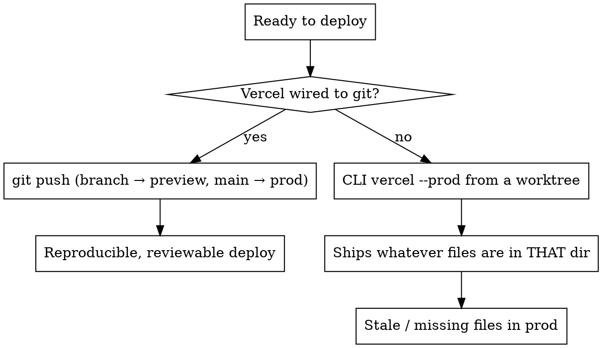

# Deploy Gated Site

## Overview

Put the dashboard behind a server-side gate, then deploy it without shipping stale code. The gate is Edge Middleware (runs before any file is served, so the HTML never reaches an unauthenticated visitor) plus a `/api/login` that swaps a hashed password for an HMAC-signed cookie. Stateless — no session store.

Core principle: **Gate server-side, not client-side. Sign the session, don't store it. Deploy from git, never from "whatever's in this folder."**

Bundled, working templates: [assets/middleware.js](assets/middleware.js), [assets/api-login.js](assets/api-login.js), [assets/api-logout.js](assets/api-logout.js), [assets/login.html](assets/login.html). Copy and adapt; the crypto is the part to not improvise.

## Why Edge Middleware, not a client check

A client-side check ships the dashboard HTML to everyone and hides it with JS — the data is one "View Source" away. Edge Middleware runs at the CDN *before* the static file resolves: an unauthenticated request to `/dashboard` gets a 302 to `/login` and never receives the page. That is the difference between a lock and a curtain.

## The auth scheme

```
/login (form) → POST /api/login
  → SHA-256(password) timing-safe compared to DASHBOARD_PASSWORD_HASH env var
  → on match: Set-Cookie disciple_session=<exp>.<HMAC-SHA256(exp, SESSION_SECRET)>; HttpOnly; Secure; SameSite=Lax
/dashboard request → middleware verifies HMAC + expiry → pass or 302 /login?next=/dashboard
/api/metrics → independently verifies the same cookie (defense in depth)
```

The cookie payload is just `<expiry>.<signature>`. No DB. If the HMAC verifies, the client didn't forge the expiry. If expired, treat as logged out. This is JWT without the library, correct for a one-user dashboard.

## The runtime split (the non-obvious part)

`/api/login` runs in the **Node serverless runtime** → use `node:crypto` (`createHash`, `createHmac`, `timingSafeEqual`).
`middleware.js` runs in the **Edge runtime** → no Node APIs; use **Web Crypto** (`crypto.subtle.importKey` + `crypto.subtle.verify`).

Same HMAC-SHA256 math, two different crypto libraries, because Vercel runs them in different runtimes. The templates implement both correctly — don't unify them by forcing Node crypto into the middleware; it will fail at the edge.

## Setting the password (the bug that will bite you)

```bash
# generate the hash + secret
node -e "const c=require('crypto');console.log('HASH='+c.createHash('sha256').update('THEPASSWORD').digest('hex'));console.log('SECRET='+c.randomBytes(32).toString('hex'))"

# set on Vercel — use printf, NEVER echo
printf "<hash>"   | vercel env add DASHBOARD_PASSWORD_HASH production
printf "<secret>" | vercel env add SESSION_SECRET production
```

`echo` appends a trailing `\n` that gets baked into the env var value. The hash comparison then fails forever with a correct password and no error message. This cost a full debug cycle on the original build. Always `printf`. Always round-trip-verify with `vercel env pull` and diff the value.

Env var changes do **not** affect existing deployments — Vercel snapshots env at build time. Every env fix requires a redeploy.

## Deploy hygiene — the trap that ships stale code

This is the single biggest failure mode and it has nothing to do with auth.



**Rules:**
1. **Wire Vercel to the GitHub repo. Production branch = `main`.** Push to main = prod; push to a branch = preview URL. Stop using `vercel --prod` from the CLI. This makes "deployed stale code from the wrong directory" structurally impossible.
2. **One source of truth.** If multiple agents/worktrees exist, their work converges by merging to `main`, not by deploying from whichever folder is open. (CLI deploys from a worktree shipped stale code three separate times on the original build — a lead-magnet page and the entire redesigned quiz vanished from prod because they lived on un-merged branches.)
3. **`.vercelignore` for everything internal.** Vercel ships every file in the project root by default. Without it, `marketing/contacts.csv`, `PRD.md`, `.env.example`, `supabase/`, `tests/` are all publicly fetchable. Exclude them explicitly.
4. **Run `vercel env pull` after every env change** and diff — env vars are deploy-time snapshots and the `echo` newline bug is invisible until you round-trip.

## vercel.json + path resolution

`cleanUrls: true` is good (strips `.html`). But `trailingSlash: false` plus a page in a subdirectory that uses *relative* asset paths breaks: the browser lands on `/quiz` (no slash), so `js/main.js` resolves to `/js/main.js` and 404s.

Fix, in order of robustness: (a) the page uses **absolute paths** (`/quiz/js/main.js`) and module-relative URLs (`new URL('../x.json', import.meta.url)`) — then trailing-slash policy is irrelevant; or (b) redirect `/quiz` → `/quiz/` so relative paths anchor correctly. Prefer (a). The dashboard itself sits at root so it's immune, but the same site's quiz/sub-pages are not — audit every route's URL contract before adding global `vercel.json` knobs.

## Smoke test after every deploy

```bash
URL=https://yoursite.vercel.app
curl -s -o /dev/null -w "%{http_code}" $URL/dashboard          # expect 302
curl -s -o /dev/null -w "%{http_code}" -X POST $URL/api/login \
  -H 'content-type: application/json' -d '{"password":"WRONG"}' # expect 401
# right password → 200 + Set-Cookie; reuse cookie → /dashboard 200, /api/metrics JSON
curl -s -o /dev/null -w "%{http_code}" $URL/marketing/contacts.csv  # expect 404 (vercelignore)
```

## Common mistakes

| Mistake | Consequence | Fix |
|---|---|---|
| Client-side auth check | HTML leaks via View Source | Edge Middleware, server-side |
| Node crypto in middleware | Fails at the edge runtime | Web Crypto in middleware, Node crypto in `/api/login` |
| `echo` to set env var | trailing `\n` breaks hash compare silently | `printf`, then `vercel env pull` to verify |
| `vercel --prod` from a worktree | ships stale/missing files | wire git deploys, deploy from `main` only |
| No `.vercelignore` | internal docs/CSVs publicly fetchable | exclude `marketing/ supabase/ tests/ PRD.md .env*` |
| Forgot to redeploy after env change | new secret not active | every env change = redeploy |
| Global `trailingSlash` knob | breaks relative paths on sub-pages | absolute/module-relative paths; audit routes first |

## End of chain

This completes the marketing-dashboard-kit chain: `discover-connectors → dashboard-data-layer (+ supabase-sql) → build-dashboard-ui → deploy-gated-site`. The result: a brand-matched, password-gated dashboard on the user's own domain, reading live data, deployed reproducibly from git.
