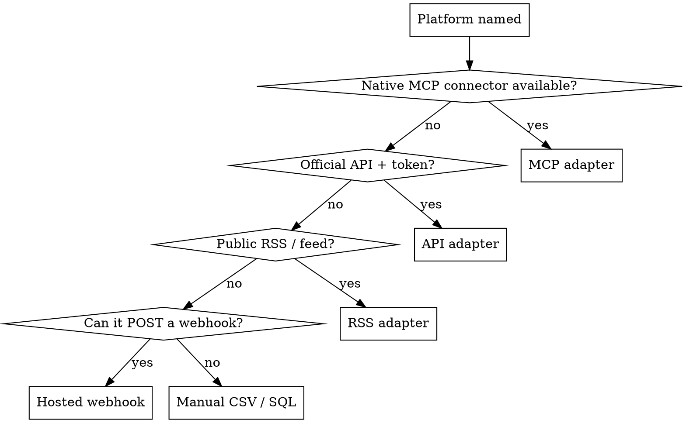

# Discover Connectors

## Overview

Before building any dashboard, you must know two things per data source: **what platforms feed it**, and **the cheapest path to read each one**. Building a custom webhook for a platform that has a native MCP connector is wasted work. Reading an RSS feed beats scraping. This skill produces a **connector map** the rest of the chain consumes.

Core principle: **Never build an integration before checking for a native one.** The order of preference is always: native MCP connector → official API → RSS/public feed → webhook you host → manual CSV import.

## When to use

- First step when a user asks for a marketing dashboard
- User says "I want to track X" and X spans multiple tools
- Before writing any `/api/metrics` adapter code

## The interview

Ask the user to name every platform in their funnel. Drive it with the funnel stages, not a tool list — tools fall out of stages:

| Funnel stage | Common platforms | Ask |
|---|---|---|
| Traffic / visits | GA4, Plausible, Vercel Analytics | "How do you measure site visits?" |
| Email list / newsletter | Substack, ConvertKit/Kit, beehiiv, Mailchimp | "Where does your newsletter live?" |
| Lead capture / quiz | Typeform, Tally, custom form | "What captures emails / quiz results?" |
| Nurture sequence | ConvertKit, Loops, Customer.io | "What sends your email sequence?" |
| Booking / calls | Calendly, Cal.com, SavvyCal | "How do people book time with you?" |
| Cold outreach | Instantly, Smartlead, manual Gmail/Apollo | "How do you run cold outreach?" |
| Payments (optional) | Stripe, Lemon Squeezy | "Do you track revenue?" |

Record the answers as a table. Unknown stages are fine — mark them `not tracked yet`.

## Resolving each platform to a connector

For every named platform, resolve it down the preference ladder and record the result.



**Checking for native MCP connectors:** look at the currently-available MCP tools/servers in the session (and the connector registry if one is exposed). Marketing platforms that commonly ship MCP connectors: HubSpot, Klaviyo, Amplitude, Ahrefs, SimilarWeb, Notion, Slack, Linear, Asana. If the platform is in that set and a connector is connected, that's the answer — stop resolving.

**Known resolutions (from real builds, save time):**

| Platform | Best connector | Notes |
|---|---|---|
| Substack | RSS at `<pub>.substack.com/feed` | No public API. RSS gives post count + titles, NOT subscriber numbers. |
| ConvertKit / Kit | Hosted webhook, **one URL per event type** | Kit fires a different webhook per event (subscribe, open, click, unsubscribe). Maintain a broadcast-id → email-number map. No native `delivered` or `reply` events. |
| Calendly | Hosted webhook, `invitee.created` | Single webhook, clean payload. |
| Custom quiz/form | You define the POST contract | Have the frontend POST `{email, result, answers, utm}` to your webhook. |
| GA4 | Data API + service account | Heaviest; only if traffic numbers are required. |
| Manual cold outreach | CSV import → SQL table | No webhook. Document the `update ... set sent_at=now()` workflow. |

## Output: the connector map

Produce a markdown table and hand it to the next skill (`dashboard-data-layer`). Required columns:

```
| Metric            | Platform   | Connector type | Status  | Notes                          |
|-------------------|------------|----------------|---------|--------------------------------|
| Landing visits    | GA4        | API adapter    | planned | needs service account          |
| Newsletter posts  | Substack   | RSS adapter    | ready   | <pub>.substack.com/feed        |
| Email sequence    | ConvertKit | hosted webhook | planned | 5 webhook URLs, id→num map     |
| Bookings          | Calendly   | hosted webhook | planned | invitee.created                |
| Quiz completes    | custom     | hosted webhook | planned | define POST contract           |
| Cold outreach     | manual     | CSV → SQL      | manual  | no automation                  |
```

Every row's `Status` is one of: `ready` (connector confirmed, can read today), `planned` (path known, not wired), `manual` (human-updated). The dashboard will show a live/pending dot per source mirroring this exactly — honesty over illusion.

## Common mistakes

- **Building a custom webhook for a platform with a native connector.** Always resolve down the ladder first.
- **Assuming Substack exposes subscriber counts.** It does not via RSS. Mark subscriber count `manual` or `not tracked`.
- **Treating ConvertKit like one webhook.** It is one webhook *per event type*; the data layer must branch on `?event=`.
- **Promising data you can't read.** If a stage has no connector, the map says `not tracked yet` and the dashboard shows `—`, not a fabricated number.

## Next in the chain

Hand the connector map to **dashboard-data-layer** (sets up the Supabase store + aggregates) which in turn feeds **build-dashboard-ui** and **deploy-gated-site**. For any source that needs database aggregates, that skill will use **supabase-sql**.
