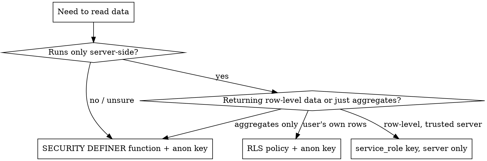

# Supabase SQL (DB-safety internal tool)

## Overview

Supabase is Postgres with a REST layer (PostgREST) and two API keys. The single most common mistake beginners make is **shipping the service-role key to the browser** to "just make the query work." This skill teaches the safe pattern: let the database do privileged reads through a narrow, named function, and never expose the powerful key.

Core principle: **The browser gets the weak key. The server gets the strong key. Aggregates get a SECURITY DEFINER function so neither key needs table access.**

## The two keys (memorize this)

| Key | Where it lives | What it can do | If leaked |
|---|---|---|---|
| `anon` / publishable | browser, public HTML, client JS | only what RLS policies allow | low blast radius (RLS still applies) |
| `service_role` | server env vars ONLY | bypasses ALL RLS, full read/write | catastrophic — full DB control |

**Rule:** `service_role` never appears in client code, never in a public repo, never in a `NEXT_PUBLIC_*` / `VITE_*` var. Server-side serverless function env var only.

## The decision: how should this endpoint read data?



## The pattern that solves 90% of dashboard reads: SECURITY DEFINER aggregate

You want counts/rates on the dashboard. You do NOT want to grant table SELECT to anyone, and you do NOT want to ship the service-role key. Answer: a function that runs as its owner (postgres), reads the tables, and returns only the numbers you choose.

```sql
create or replace function public.dashboard_funnel_metrics()
returns json
language sql
security definer            -- runs with the function owner's privileges, bypassing RLS
set search_path = public    -- REQUIRED: prevents search_path hijacking attacks
stable
as $$
  select json_build_object(
    'quiz_started',   (select count(*) from quiz_events where event_type='started'),
    'quiz_completes', (select count(*) from quiz_submissions),
    'optins',         (select count(*) from quiz_contacts),
    'latest',         (select max(created_at) from quiz_submissions)
  );
$$;

revoke all on function public.dashboard_funnel_metrics() from public;
grant execute on function public.dashboard_funnel_metrics() to anon, authenticated, service_role;
```

The caller (even with the public `anon` key) gets only those four numbers. They get **zero** ability to read raw rows. The blast radius is exactly the function's return shape.

Call it over PostgREST RPC:

```js
await fetch(`${SUPABASE_URL}/rest/v1/rpc/dashboard_funnel_metrics`, {
  method: 'POST',
  headers: {
    apikey: SUPABASE_ANON_KEY,
    Authorization: `Bearer ${SUPABASE_ANON_KEY}`,
    'content-type': 'application/json',
  },
  body: '{}',
});
```

**Two non-negotiables on SECURITY DEFINER functions:**
1. `set search_path = public` — without it, a malicious user can create objects in their own schema and hijack what your function resolves to. This is the classic SECURITY DEFINER exploit.
2. Return aggregates, never `select *`. The function IS the security boundary; keep its output minimal.

See [references/security-definer.md](references/security-definer.md) for hardening, parameterized variants, and the privilege-escalation footguns.

## RLS in one screen

Row Level Security is OFF by default — meaning the table is wide open to anyone with any key until you enable it. Enabling with no policy means **deny all** (except service_role, which always bypasses).

```sql
alter table contacts enable row level security;
-- No policy yet => anon/authenticated get NOTHING. service_role still full access.

-- Public form needs to INSERT but never read:
create policy "public can insert" on contacts
  for insert to anon with check (true);
-- Note: no SELECT policy => the same anon key cannot read the table back.
```

Counting rules and the `Prefer: count=exact` header trick for getting counts without pulling rows are in [references/rls-and-keys.md](references/rls-and-keys.md).

## Quick reference

| Task | Approach |
|---|---|
| Public form writes a row | `enable rls` + `for insert to anon with check (true)`, no select policy |
| Dashboard needs counts | SECURITY DEFINER function returning `json_build_object(...)`, grant execute to anon |
| Server needs raw rows | service_role key, server env var only, never client |
| User reads their own rows | RLS policy `using (auth.uid() = user_id)` + anon key |
| Get a count cheaply | `Range: 0-0` + `Prefer: count=exact`, read `content-range` header |
| Apply schema change | `apply_migration` (DDL) — never hand-run DDL in `execute_sql` |

## Common mistakes

- **Shipping `service_role` to the browser** to make a query work. Use a SECURITY DEFINER function instead.
- **`SECURITY DEFINER` without `set search_path`.** Privilege-escalation hole. Always set it.
- **Enabling RLS and being surprised reads break.** Enabling with no SELECT policy = no reads for anon. That's correct; add a function or policy.
- **`select *` inside a definer function.** Defeats the purpose; the function's output is the security boundary.
- **Running DDL through generic SQL execution** instead of a migration — loses the change history and reproducibility.

## Real-world impact

On the Disciple AI dashboard build, this pattern let a public-key endpoint show live quiz-funnel counts with zero risk of raw contact-row exposure and no service-role key anywhere in the deploy. One function, four numbers, no leak.
